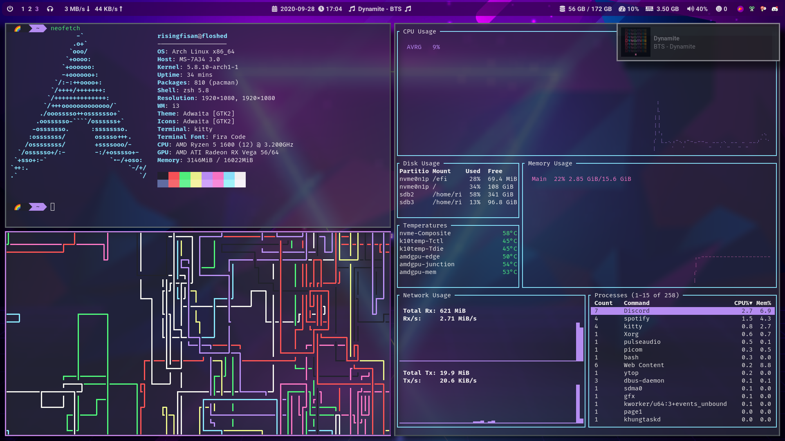

# dotfiles

## Screenshot

## Details

- **Distro**: [Manjaro Linux](https://manjaro.org/);
- **Window Manager (WM)**: [i3-gaps](https://github.com/Airblader/i3);
- **Shell**: zsh ([Oh My Zsh](https://ohmyz.sh/));
- **Terminal Emulator**: [kitty](https://sw.kovidgoyal.net/kitty/);
- **Status Bar**: [polybar](https://polybar.github.io/);
- **Font**: [Fira Code](https://github.com/tonsky/FiraCode) (terminal), [Roboto](https://fonts.google.com/specimen/Roboto) (status bar);
- **Editor**: [neovim](https://github.com/neovim/neovim), [Visual Studio Code](https://code.visualstudio.com/);
- **Clipboard Manager**: [clipster](https://github.com/mrichar1/clipster/);
- **Notification Daemon**: [dunst](https://github.com/dunst-project/dunst);
- **Window Switcher**: [rofi](https://github.com/davatorium/rofi);
- **Screenshot Tool**: [flameshot](https://github.com/lupoDharkael/flameshot);
